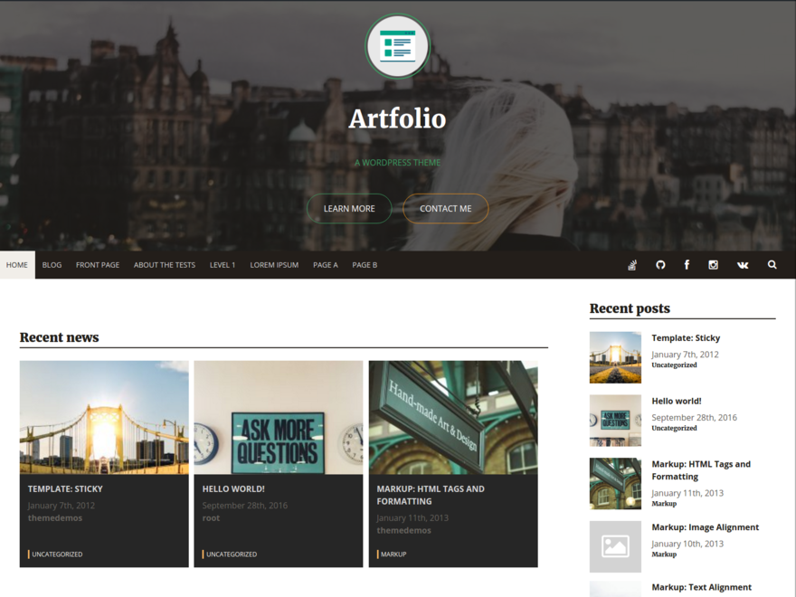

___

# WordPress theme [Arfolio](https://themes.trac.wordpress.org/ticket/33947#no0)
## **Current version: 1.21.69** ( 2017, 1 mar )
===========================

## Description
Artfolio is a free responsive, high-resolution blog theme featuring custom header, slider and custom link colors, large images, logo image and easy to read typography that scales to fit all screens. Other features include keyboard accessible navigation, optional social menu at the header and footer(supports 27 social icons of the popular networks), landing menu, index, sidebar and footer widgets, aside post format and stylish recent posts widget, fully-editable footer copyright section. Artfolio will make your WordPress look beautiful everywhere.

## **Quick links**
* **[Documentation](https://github.com/artem-solovev/artfolio/wiki)**
* **[Issues, bugs](https://github.com/artem-solovev/artfolio/issues)**
* **[For contributors](https://github.com/artem-solovev/artfolio/wiki/For-contributors)**

## **Features**
* Slider ( responsive ) for header
* Background-image for header
* Icon for header
* Design
    * Fully responsive design
    * Mobile-first
    * Unique design
* Menus
    * Landing menu
    * Social menu ( 27 websites )
* Recent posts widget ( for index page and sidebar )

## Desktop version

## Installation

1. In your admin panel, go to `Appearance > Themes` and click the `Add New button`.
2. Click `Upload` and Choose File, then select the theme's .zip file. Click Install Now.
3. Click Activate to use your new theme right away.

## Frequently Asked Questions

Does this theme support any plugins?
* Artfolio includes support for Infinite Scroll in Jetpack.

## **Contributors**
* [Artem Solovev](https://github.com/artem-solovev)

## Credits

* Based on Underscores http://underscores.me/, (C) 2012-2016 Automattic, Inc., GPLv2 or later
* Camera slideshow http://www.pixedelic.com/plugins/camera/
* Font awesome http://fontawesome.io/
* jQuery easing http://gsgd.co.uk/sandbox/jquery/easing/
* jQuery mobile customized https://github.com/pixedelic/Camera/tree/master/scripts
* Superfich https://github.com/joeldbirch/superfish
* normalize.css http://necolas.github.io/normalize.css/, (C) 2012-2016 Nicolas Gallagher and Jonathan Neal, MIT
* Header image by Omar Yassen, (C) https://www.instagram.com/haveyouseenomar
* Icon image by Crumbs + Pixels, (C) https://www.iconfinder.com/Ikonografia

===========================

*Requires at least*: 4.0
*Tested up to*: 4.4.2
*Stable tag*: 1.0.0
*License*: [GPLv3](https://www.gnu.org/licenses/gpl-3.0.en.html)

**Tags**: translation-ready, custom-background, theme-options, custom-menu, post-formats, threaded-comments